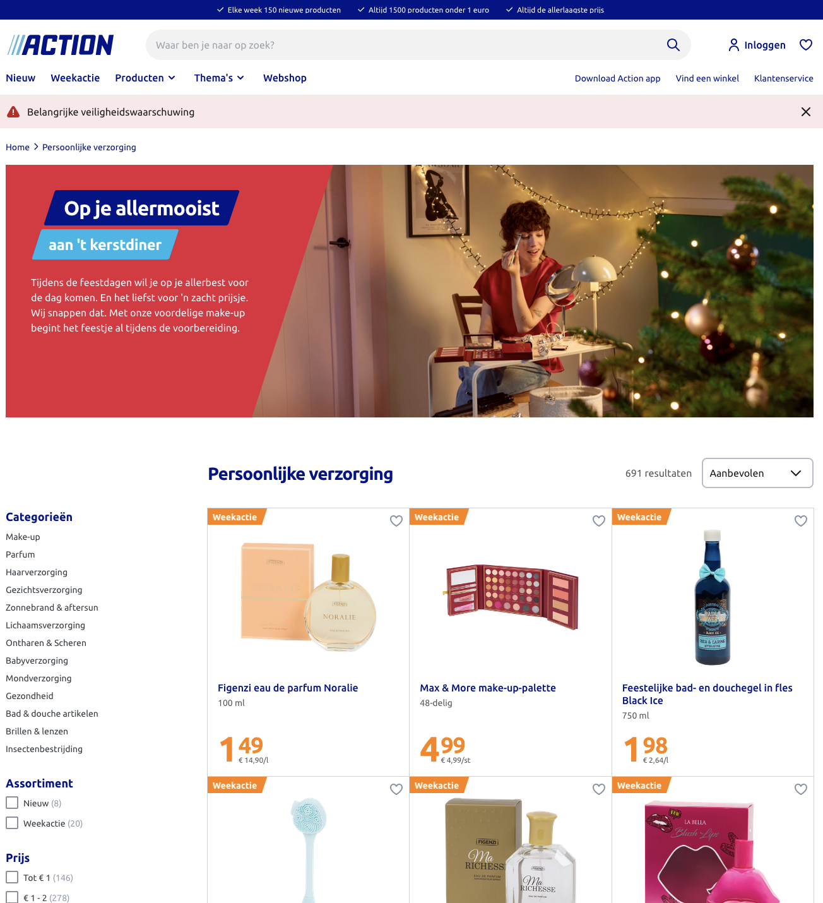

# Procesverslag
Markdown is een simpele manier om HTML te schrijven.  
Markdown cheat cheet: [Hulp bij het schrijven van Markdown](https://github.com/adam-p/markdown-here/wiki/Markdown-Cheatsheet).

Nb. De standaardstructuur en de spartaanse opmaak van de README.md zijn helemaal prima. Het gaat om de inhoud van je procesverslag. Besteedt de tijd voor pracht en praal aan je website.

Nb. Door *open* toe te voegen aan een *details* element kun je deze standaard open zetten. Fijn om dat steeds voor de relevante stuk(ken) te doen.

## Jij

  
uitwerken voor kick-off werkgroep

  ### Auteur:
  Jayden Karg

  #### Je startniveau:
  blauw

  #### Je focus:
  surface plane
 

   

## Je website

  
uitwerken voor kick-off werkgroep

  ### Je opdracht:
 (https://www.action.com/nl-nl/)

  #### Screenshot(s) van de eerste pagina (small screen): 
  www.action.com   
  

  #### Screenshot(s) van de tweede pagina (small screen):
  Ledfiguur  
  
 

## Toegankelijkheidstest 1/2 (week 1)

  
uitwerken na test in 2e werkgroep

  ### Bevindingen
  Lijst met je bevindingen die in de test naar voren kwamen:
  1. WC3 constanteerde veel fouten. Op een andere website kon het niet 
  gecontroleerd worden om dat die functie geblokeerd was met de foutcode 403 Forbidden.

  2. Er zit niet genoeg ruimte tussen interactieve items om een scroll gebied te creëren.

  3. Niet alle images hebben een alt attribute.

  4. De media die wordt getoont wordt op autoplay afgespeeld en loopt in een loep.

  5. De video's worden niet onderbouwd met captions. 

  6. Transcrips zijn niet aanwezig. 

  7. Er is geen skip link (controls).

  8. Dark en lightmodes worden niet ondersteund.

  9. High contrast mode worden niet ondersteund.

  10. De tekst kan niet vergroot worden naar 200%.

## Breakdownschets (week 1)

  
uitwerken na afloop 3e werkgroep

  ### de hele pagina: 
  

  

  ### dynamisch deel (bijv menu): 
  

  ### wellicht nog een dynamisch deel (bijv filter): 
  

## Voortgang 1 (week 2)

  
uitwerken voor 1e voortgang

  ### Stand van zaken
  hier dit ging goed & dit was lastig (neem ook screenshots op van delen van je website en code)

  Voor mij was het aan het begin lastig om het onderscheid te maken tussen een section en een article, Wanneer gebruik je wat en in welke situaties gebruik je articles of een ul.

  Tijdens de les heb ik meerdere aantekeningen en oefeningen gedaan die kunnen helpen bij het maken van de website.

  Doordat we tijdens de les ook een opzet hebben maken van de html op de pagina was het al wat makkelijker om te beginnen met de code.

  Hier een voorbeeld van de opzet:   <!--Voeg plaatje toe van Figma>
  

  ### Agenda voor meeting
  samen met je groepje opstellen

  | student 1      | student 2          | student 3    | student 4        |
  | ---            | ---                | ---          | ---              |
  | dit bespreken  | en dit             | en ik dit    | en dan ik dat    |
  | en dat ook nog | dit als er tijd is | nog een punt | dit wil ik zeker |
  |...             | ...                | ...          | ...              |

  ### Verslag van meeting
  hier na afloop snel de uitkomsten van de meeting vastleggen

  - punt 1 Uitleg over het verschil tussen <sections> & <article> <!--<section> = container & <article> = Thema's of contet dat verplaatst kan worden op de website>
  - punt 2 H1 maken van het logo (homepage) alt"Action" <!--De H1 op de landingspagina is in mijn geval het logo omdat mensen met een screenreader dat dan lezen of horen>
  - punt 3 In de footer aanmelden <Form> (button geen link) <!--Een link verwijst naar een ander pagina & een butten verstuurd data>
  - 

## Voortgang 2 (week 3)

  
uitwerken voor 2e voortgang

  ### Stand van zaken
  hier dit ging goed & dit was lastig (neem ook screenshots op van delen van je website en code)

  Ik had moeite met het maken van de tweede pagina, omdat ik twijfelde of ik een nieuwe css stylesheet moest maken of de zelfde moest gebruiken. Uiteindelijk heb ik de css behouden en geen nieuwe aan gemaakt. Toen liep ik tegen het probleem aan dat sommige elementen veranderden op mijn homepagina. Uiteindelijk heb ik ervoor gekozen om een nieuw css bestand aan te maken. <!-- 2.css>

  

  ### Agenda voor meeting
  samen met je groepje opstellen

  | student 1      | student 2          | student 3    | student 4        |
  | ---            | ---                | ---          | ---              |
  | dit bespreken  | en dit             | en ik dit    | en dan ik dat    |
  | en dat ook nog | dit als er tijd is | nog een punt | dit wil ik zeker |
  | ...            | ...                | ...          | ...              |

  ### Verslag van meeting
  hier na afloop snel de uitkomsten van de meeting vastleggen

  - De juiste section benoemen
  - Hulp bij het stijlen van mijn 2e section
  - Opmaak van de tekst veranderen
- ...

## Toegankelijkheidstest 2/2 (week 4)

  
uitwerken na test in 9e werkgroep

  ### Bevindingen
  Lijst met je bevindingen die in de test naar voren kwamen (geef ook aan wat er verbeterd is):

  1. Website kan gevalideerd worden
  2. De visible focus style is duidelijker zichtbaar 
  3. Ruimte tussen interactieve elementen
  4. Alle images hebben een alt atribute gekregen of een arial-label
  5. Dark and light mode toegevoegd
  6. Niet alle punten waren voor mij van toepassing
  7. Er is geen skip link (controls).

## Voortgang 3 (week 4)

  
uitwerken voor 3e voortgang

  ### Stand van zaken
  hier dit ging goed & dit was lastig (neem ook screenshots op van delen van je website en code)
  
  De tweede pagina ging sneller dan de eerste, dit kwam voornamelijk omdat ik al wat codes in de vingers had van de vorige pagina die in mijn ogen complexer was dan de twee. Veel elementen kwamen terug zoals de afbeeldingen in de vorm van een carousel, de buttons, navigatie en de footer. 

  Het enigste onderdeel waar ik wat moeite mee had was de h2 specificatie. Na veel uitgeprobeerd te hebben is het mij toch gelukt om het ongeveer hetzelfde eruit te laten zien als de oorspronkelijke website. Ik heb hier gebruik gemaakt van de border-bottom-style: dashed;. Het is mij niet gelukt om ruimte te krijgen tussen twee woorden (h2 specificatie) hiervoor heb ik AI geraadpleegd. De bron is vervemeld met de bijbehorende prompt en link naar de chat. 

  Ook heb ik een light en darkmodeknop toegevoed. Als ik meer tijd had zij ik deze ook werkend hebben gemaakt met javascript. Nu werkt de code ook maar moet ik hem handmatig aanpassen door in de body div="darkmode" toe te passen. Tot slot heb ik de :focus-visible vervangen door een rode zichtbare kleur.

  ### Agenda voor meeting
  samen met je groepje opstellen

  | student 1      | student 2          | student 3    | student 4        |
  | ---            | ---                | ---          | ---              |
  | dit bespreken  | en dit             | en ik dit    | en dan ik dat    |
  | en dat ook nog | dit als er tijd is | nog een punt | dit wil ik zeker |
  | ...            | ...                | ...          | ...              |

  ### Verslag van meeting
  hier na afloop snel de uitkomsten van de meeting vastleggen

  - Pagina op github zetten
  - Beginnen aan de tweede pagina
  - Puntjes op de i zetten
  - Verslag bijhouden voor het eindgesprek

## Eindgesprek (week 5)

  
uitwerken voor eindgesprek

  ### Je uitkomst - karakteristiek screenshots:
  
  

  ### Dit ging goed/Heb ik geleerd: 
  Korte omschrijving met plaatjes

  
  De vorm leek op het eerste oog heel ingewikkeld om te maken, nadat ik onderzoek heb gedaan heeft een studentenassistent mij verwezen naar een webiste waarbij ik de vorm zelf kon maken en de code kon kopieren in mijn css.

  
  
  Ik heb geleerd hoe je een hamburger menu kunt maken met javascript waar ik best veel moeite mee heb. 

  ### Dit was lastig/Is niet gelukt:
  Korte omschrijving met plaatjes

  
  Het was lastig om de letters in bold rechts aligned te krijgen, hierbij heb ik hulp ingeschakeld van ChatGPT maar zonder resultaat. Ik heb geprobeerd om ze uit elkaar te halen met   maar dat heeft ook niet gewerkt. Uiteindelijk heb ik nog geprobeerd om met spaties te werken maar ook zonder resultaat.

## Bronnenlijst

  
continu bijhouden terwijl je werkt

  Nb. Wees specifiek ('css-tricks' als bron is bijv. niet specifiek genoeg). 
  Nb. ChatGpT en andere AI horen er ook bij.
  Nb. Vermeld de bronnen ook in je code.

  1. https://www.action.com/nl-nl/ <!-- Eerste pagina>
  2. https://www.w3schools.com/howto/howto_css_menu_icon.asp <!-- Instructie menu>
  3. https://css-tricks.com/snippets/css/a-guide-to-flexbox/ <!-- Flexbox>
  4. https://bennettfeely.com/clippy/ <!-- Clip-path>
  5. https://www.action.com/nl-nl/p/3208466/ledfiguur/ <!-- Tweede pagina>
  6. Studentenassistent
  7. https://codepen.io/your-work <!-- Mijn eigen werk die ik al eerder heb gemaakt, hier kon ik de codes terug vinden>
  8. https://github.com/ 
  9. https://chatgpt.com/share/6762b2b5-20f8-8013-9219-c9374ae82048 <!-- Prompt: "hoe kan ik space krijgen tussen specifieke woorden die ik wil in css"> 
  10. https://www.action.com/nl-nl/c/wonen/
  11. https://www.action.com/nl-nl/c/keuken/
  12. https://www.action.com/nl-nl/c/huishouden/
  13. https://www.action.com/nl-nl/c/kantoor--school/
  14. https://fonts.google.com/icons?selected=Material+Symbols+Outlined:light_mode:FILL@1;wght@400;GRAD@0;opsz@24&icon.query=light&icon.size=24&icon.color=%235f6368 

